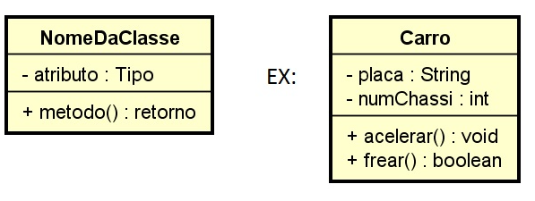

# Anotações aula de Programação Orientada a objetos;

<subtitle> Ferramenta de uso Eclipse <subtitle>


<h3>Apresentação da syntax do java Padrão;</h3>

```java
        System.out.println("Apreentação syntax inicial Java");
		int idade;
		idade = 23;
		//System.out.printf("A idade é %d \n", idade);
		System.out.println("A idade é igual a " + idade);
		System.out.println("O individuo tem "+ idade + " anos");
		
		char c = 'r';
		System.out.println("O char é " + c);
		float f = 3.14f;
		System.out.println("O float é " + f);
		double d = 3.141592;
		System.out.println("O double é " + d);
```

<h4> Atalhos:</h4>  

* Crt+Shift+/ --> Comentar varias linhas  
* Alt+Shift+R --> Refatorar variaveis  


## Orientação a Objetos
### Classe é uma Estrutura
